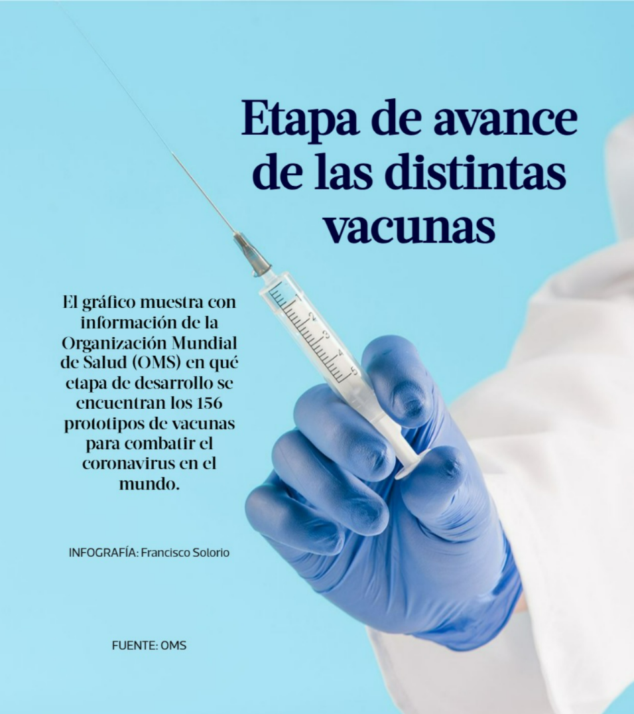
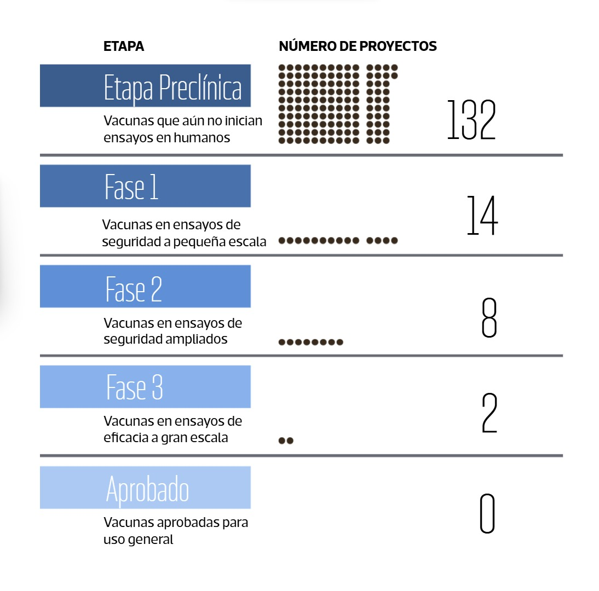
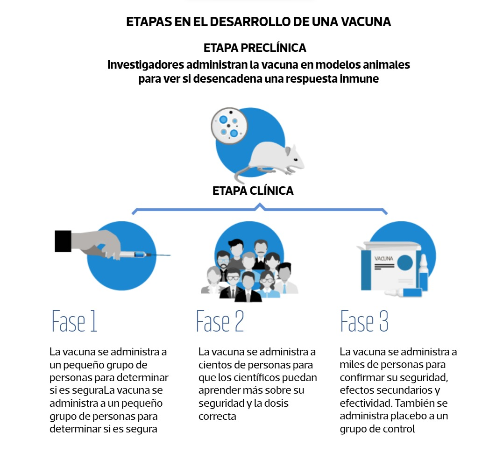
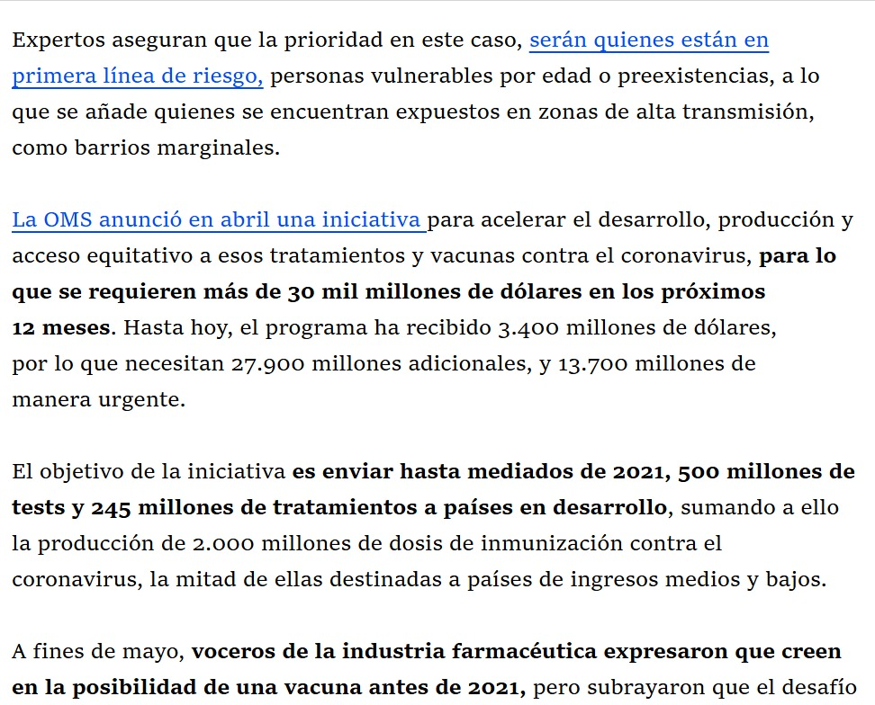

# TAREA 1

## **¿Qué tan cerca estamos de encontrar una vacuna? Ya hay 24 prototipos probándose en humanos - [La Tercera](https://www.latercera.com/que-pasa/noticia/que-tan-cerca-estamos-de-encontrar-una-vacuna-ya-hay-24-prototipos-probandose-en-humanos/533JTDXN7JF6PE7RK7WWB6P73I/).**

### _Descripción de la historia que cuenta_

La nota se sitúa a siete meses del inicio del coronavirus en China, específicamente el 2 de julio de 2020, donde la **incertidumbre sobre una vacuna persistía.**

Sin embargo, la [Organización Mundial de la Salud](https://www.who.int/es) mantuvo optimismo: se estimaba que las **primeras dosis podrían estar listas para finales de 2020**, priorizando a los grupos más vulnerables.

Lo llamativo de esto es que las vacunas toman años de pruebas para producir a gran a escala, pero los científicos de ese entonces esperaban desarrollar una vacuna contra el coronavirus dentro de **12 a 18 meses**.

### _¿Por qué me pareció interesante?_

Me pareció interesante por la **infografía** que está al final de la nota, porque es **muy dinámica y tiene datos muy interesantes**. Por su parte, el texto también entrega mucha información, contando de qué manera podría llegar la primera vacuna contra el coronavirus. 

La mayor parte de la nota es harto texto y siento que da muchos detalles respecto a los efectos secundarios. Lo anterior indica que no solo se quedaron con la primera noticia, sino que **indagaron más allá de lo obvio** y se dieron la tarea de buscar una base de datos sobre el número de proyectos. 

### _Efectividad para transmitir información_

A mí me habría gustado que la infografía estuviera al principio o al medio de la nota, porque creo que es **demasiado texto** para luego llegar a imágenes tan amenas visualmente y que se pudieron usar más. Lo que valoro es que haya movimiento cada vez que uno pasa la "lámina", pero no es algo que moleste a la visión, sino que algo muy sutil. 

Del texto lo que puedo destacar que hay varios links y muchas frases subrayadas en negritas. El estilo para escribir que tiene [La Tercera](https://www.latercera.com/) a mí siempre me ha gustado y lo disfruto mucho, porque cada párrafo es breve, lo que ayuda a la lectura. Sin embargo, creo que incluso **uno o dos párrafos del texto junto con la infografía habrían sido suficientes**. 

#### **Uso de la aguja**

* Lo otro, es que tal vez el ilustrador pudo haber jugado un poco más con la **imagen de la aguja**, es decir, comenzar con la primera lámina tal como está, pero luego pudo haber hecho un zoom a la vacuna en la segunda imagen para contar sobre sus componentes, por ejemplo. 

* Respecto a la idea anterior, también el diseñador pudo hacer este **zoom** para describir cada posible vacuna con sus efectos secundarios, el laboratorio y mostrar en qué fase estaban.

#### **Inversiones**

* Por otra parte, hay muchos números sobre las inversiones que realizó la [OMS](https://www.who.int/es) para acelerar el avance de las vacunas contra el coronavirus, por ejemplo, en abril de 2020, la organización internacional puso en marcha un plan global para agilizar la creación y distribución justa de tratamientos y vacunas contra el COVID-19. La iniciativa tuvo un costo estimado de **31.300 millones de dólares** para el primer año.

* Luego de ese primer número grande, se pudo haber **desglosado** en la infografía las otras cifras de las inversiones. 

### _En resumen:_ 

| Pros | Contras |
| --- |:---------:|
| Muchos detalles | Texto de sobra |
| Varios links y uso de negritas | Poca infografía |
| Entrega de cifras | Mala distribución de números 